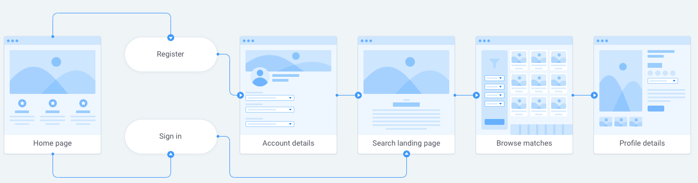
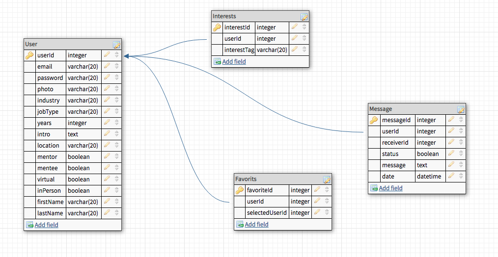

# MENTOR CONNECTOR

Mentor Connector ia an app to connect mentors and mentees in the tech industry based on their interests, career path, and meeting preferences.

## FEATURES
  ### Principle Features
  - User registration and login
  - Password hashing and user authentication
  - View user profiles and sort based on interests and location
  - Add users to "favorites"
  
### Future Features
- Ability to edit own profile
- User messaging platform

## STACK
Mentor Connector is built using React, Express, Node.js, MySQL and Bootstrap. Password hashing with bcrypt and user authentication with Passport.js.

## PLAN
  ### User Flow
  
   
  
  ### Database schema
  
   

  ### API routes
  
   [API Routes](https://docs.google.com/document/d/1P2ndlCaVfjCZcYH2Ks4DL1yTig-ohl5nyE02szWsx_8/edit)
  

## SETUP

### Dependencies
- Run `yarn` in project directory. This will install root project dependencies such as `npm-run-all`.
- Run `yarn install-all` to install dependencies in both client and api folders.

### Database Preparation
- Create `.env` file in the api directory and add `DB_PASS=YOURPASSWORD` and `DB_NAME=myFridge`.
- Copy `mysql -u root -p -e "create database mentoring"` into your terminal to create a database in MySQL.
- Run `yarn add db-migrate-mysql` in the terminal to access db mirate database files

### Run Your Build
- Run `yarn start` in project directory. This will start both `api` and `client` servers in parallel.

## Next steps
- Don't forget to create a `.gitignore` file in your project root and add files such as your `.env` and `/node_modules` directories.
- Modify your code as you please and make sure to commit changes to your own repository!  

### Begin
Run `yarn start` in the parent folder in your terminal.

_This is a student project that was created at [Codely](http://codely.tech), a full stack development bootcamp in Barcelona._